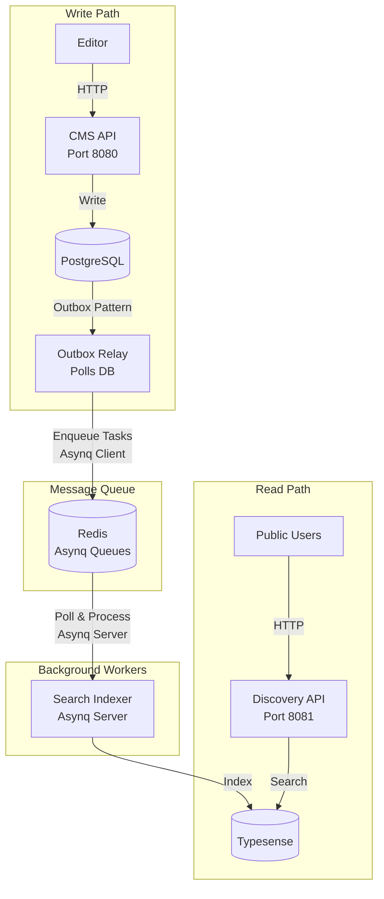

# MediaCMS

A content management and discovery system for media programs.

## Architecture

The system consists of four services that work together to provide content management and search capabilities:



## Tech Stack

- **Golang**
- **PostgreSQL**
- **Redis** - Job queue and session storage
- **Asynq** - Job queue processing
- **Typesense** - Full-text search engine
- **Chi** - HTTP router
- **JWT** - Authentication
- **Swagger** - API documentation

## Quick Start

### Prerequisites

- Go 1.25+
- Docker and Docker Compose
- [`taskfile`](https://taskfile.dev/)
- [`migrate`](https://pkg.go.dev/github.com/golang-migrate/migrate/v4)

### Setup

1. Clone the repository:

```bash
git clone <repository-url>
cd mediacms
```

2. Start infrastructure services:

```bash
task up:infra
```

This starts PostgreSQL, Redis, and Typesense containers.

3. Run database migrations:

```bash
task migrate
```

4. Run services:

```bash
task up
```

## Available Tasks

The project uses Task (Taskfile.yml) for common operations:

```bash
task build              # Build all services
task test:unit          # Run unit tests
task test:integration   # Run integration tests
task migrate            # Run database migrations
task sqlc               # Generate database code from SQL
task swagger:gen        # Generate Swagger documentation
task up:infra           # Start infrastructure only (postgres, redis, typesense)
task up                 # Start all services in Docker
task down               # Stop Docker services
task logs               # View Docker logs
task purge              # Remove all Docker resources
```

## Project Structure

```
.
├── cmd/                   # Service entry points
│   ├── cms-api/           # Content management API
│   ├── discovery-api/     # Public search API
│   ├── outbox-relay/      # Outbox polling service
│   └── search-indexer/    # Typesense indexing worker
├── internal/
│   ├── cms/               # CMS API internals
│   ├── discovery/         # Discovery API internals
│   ├── outboxrelay/       # Outbox relay internals
│   ├── searchindexer/     # Search indexer internals
│   └── shared/            # Shared domain models and utilities
├── config/                # Configuration loading
├── migrations/            # Database migrations
├── docs/                  # Generated Swagger docs
└── docker-compose.yml
```

## API Documentation

- **CMS API**: http://localhost:8080/swagger/index.html
- **Discovery API**: http://localhost:8081/swagger/index.html

## Testing

Run unit tests:

```bash
task test:unit
```

Run integration tests (requires infrastructure running):

```bash
task up
task migrate
task test:integration
```

## Deployment

### Environment Variables

Each service requires specific environment variables. See individual service READMEs for details.

### Default Credentials

Default admin account is created on first startup:

- Email: `admin@mediacms.local`
- Password: `changeme`

Change these via `DEFAULT_ADMIN_EMAIL` and `DEFAULT_ADMIN_PASSWORD` environment variables.

### GCP Architecture

| Component      | GCP Service                             | Why                                                      |
| -------------- | --------------------------------------- | -------------------------------------------------------- |
| cms-api        | Cloud Run                               | Stateless API, only pay when used                        |
| discovery-api  | Cloud Run                               | Stateless API, scales automatically                      |
| outbox-relay   | Compute Engine (Container-Optimized OS) | Needs to run continuously to poll the database           |
| search-indexer | Compute Engine (Container-Optimized OS) | Needs to run continuously to process queue tasks         |
| PostgreSQL     | Cloud SQL for PostgreSQL                | Managed database, handles backups and HA                 |
| Redis          | Memorystore for Redis                   | Managed Redis with automatic failover                    |
| Typesense      | Compute Engine (Managed Instance Group) | Needs persistent storage and low-latency, can auto-scale |
| Secrets        | Secret Manager                          | Environment variables                                    |

### TODO

Should really create Terraform configs for this instead of clicking around in the console.
